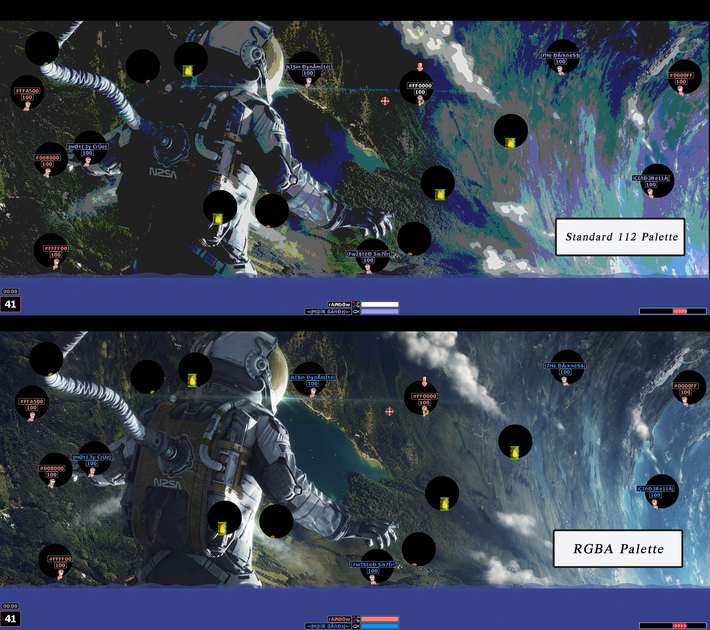

# wkRGBA

> **Beta:** wkRGBA is under active development. Keep the same module version on every computer participating in an RGBA match and report reproducible issues with the map and selected scheme.

**wkRGBA brings true-colour terrain to Worms Armageddon.**

Worms Armageddon normally renders colour maps through an indexed palette. A colour map can use no more than 112 terrain colours because the remaining palette entries are reserved by the game for worms, weapons, effects and interface elements. Photographs, illustrations and other detailed images must therefore be reduced to that small palette before they can be used as terrain. This produces visible banding, colour loss and dithering, particularly on gradients and high-resolution artwork.

wkRGBA removes that visual restriction. It keeps a native indexed representation for Worms Armageddon's terrain logic and collision system, while preserving and rendering the original 32-bit RGBA image through the Direct3D 9 Shader renderer. The game continues to control destruction, collision, worms, objects, effects and the interface; wkRGBA replaces the visible terrain pixels with their original colours. This allows maps containing thousands or millions of colours to be played without reducing their artwork to the native 112-colour palette.



*The same map rendered with Worms Armageddon's standard 112-colour terrain palette (top) and its original RGBA colours through wkRGBA (bottom).*

## Features

- Loads 32-bit RGBA PNG maps from `User\SavedLevels`.
- Preserves the original RGB and alpha channels without colour quantisation or dithering.
- Uses the PNG alpha channel to define the initial terrain collision mask.
- Keeps opaque black pixels as solid terrain.
- Follows the game camera and updates destroyed terrain during play.
- Supports the Direct3D 9 Shader renderer used by Worms Armageddon 3.8.1.
- Integrates with the native map editor, borders, automatic worm placement and generated holes.
- Includes multiplayer map transport and replay metadata support.
- Leaves native indexed maps unchanged.

Pixels with alpha values of 128 or greater are treated as solid terrain. Pixels below that threshold are treated as empty space. Partially transparent solid pixels retain their original alpha for rendering.

## RGBA format and colour capacity

RGBA stores four independent 8-bit channels: red, green, blue and alpha. wkRGBA therefore supports:

- **16,777,216 RGB colours** (`256 × 256 × 256`);
- **256 alpha levels** for every RGB colour;
- **4,294,967,296 possible RGBA channel combinations** (`256⁴`).

The number of distinct colours actually used by a map cannot exceed its number of pixels, but it is no longer restricted to a 112-entry terrain palette. The alpha channel controls both transparency and the initial solid/empty terrain classification.

wkRGBA expects a standard, static, 32-bit RGBA PNG with 8 bits per channel. Indexed PNG files continue to use Worms Armageddon's native loader and do not activate true-colour rendering. Animated PNG files are not supported.

## Exporting a map

Map authors no longer need to fill empty areas with pure black. Export the playable artwork over a transparent canvas:

- use **fully opaque pixels** (`alpha 255`) for ordinary solid terrain;
- use **fully transparent pixels** (`alpha 0`) for empty space;
- alpha values from **128 to 255** are solid and retain their visual transparency;
- alpha values from **0 to 127** are empty and cannot support worms or objects;
- opaque black is valid solid terrain, while transparent black is empty space;
- do not flatten the image against a black background before exporting;
- do not convert the image to an indexed or 112-colour PNG.

For the most predictable collision edges, use alpha 0 for air and alpha 255 for terrain. Intermediate alpha values are useful for visual effects, but the collision boundary still follows the fixed threshold at 128.

Save the file as a PNG in `Worms Armageddon\User\SavedLevels`. Map dimensions must follow the colour-map rules enforced by Worms Armageddon: dimensions must be multiples of 8, and the tested game version requires a minimum canvas of 640 × 32 pixels. Very large maps are accepted by wkRGBA, but consume more memory and take longer to transfer in multiplayer games.

When editing, keep the original layered project file from your image editor. Worms Armageddon's map editor operates on wkRGBA's indexed compatibility representation and cannot currently save changes back into the original lossless RGBA artwork.

## Multiplayer compatibility and lobby messages

The host distributes both a native compatibility map and the additional RGBA artwork. The result depends on which players have wkRGBA installed:

- **Host and client both use wkRGBA:** both sides can render the original RGBA artwork. The host is informed which connected players have the module installed, and the client receives `The host is using wkRGBA module.` when joining the lobby.
- **The host uses wkRGBA but a client does not:** the host is informed which player is missing the module. The client receives `The host is using wkRGBA. You do not have this module installed, feker! The selected map will suck!` and automatically receives the native 112-colour compatibility version of the map.
- **The host does not use wkRGBA:** no RGBA artwork is transmitted. Even if a client has wkRGBA installed, the match uses the standard native map supplied by the host.
- **Several clients are connected:** the host message lists the players detected with or without the module, allowing the host to check compatibility before starting the match.

The 112-colour fallback allows a client without wkRGBA to display the same basic terrain and collision layout, but it cannot reproduce the original true-colour artwork. Because this is a beta, using the same wkRGBA build on every computer remains the recommended configuration for online play.

## Requirements

- Worms Armageddon 3.8.1
- Direct3D 9 Shader selected as the game's graphics renderer
- WormKit module loading enabled
- Windows with Direct3D 9 support

For the best multiplayer experience, every participant should install the same wkRGBA build. A 112-colour fallback is provided for clients without the module, but mixed lobbies need further testing across schemes and large maps.

## Installation

Place `wkRGBA.dll` in the main Worms Armageddon directory, next to `WA.exe`. Start the game normally and select an RGBA PNG from `User\SavedLevels`.

The module creates a `wkRGBA` directory beside the game executable for its runtime files and logs.

## Current limitations

wkRGBA is usable, but it still has areas that need further development and testing:

- **Multiplayer synchronisation:** map changes, reconnects and mixed lobbies can still expose timing or synchronisation problems, including desynchronisation when host and client do not activate the same map state. The 112-colour fallback does not guarantee that every scheme and editor-generated map state is already problem-free.
- **Large map transfers:** high-resolution Rope Race and Big Rope Race maps can contain tens of megabytes of compressed artwork. Their transfer and verification can take considerably longer than the native map transfer. The host's loading indicator may report a client as ready before the complete RGBA payload has been processed.
- **Editor preview consistency:** generated holes, their monochrome outlines and the final cropped area do not always appear immediately in the editor preview. Reloading or regenerating the map may produce a different preview even when the selected settings have not changed.
- **Border state:** combinations involving only the top border require more testing. The temporary clearance used for automatic worm placement must be removed whenever a real top border is present, without cropping or shifting the original artwork.
- **First-frame artefacts:** on some maps, interface elements such as the wind bar or team name can briefly leave an incorrect terrain-coloured halo during the first load.
- **Native terrain effects:** destruction is synchronised with the RGBA artwork, but every native colour transformation, such as burning or darkening terrain, may not yet have an exact RGBA equivalent.
- **Saving from the editor:** wkRGBA protects the original RGBA file from being overwritten by the native indexed editor representation. Saving an edited map under a new name currently produces the game's native representation rather than a lossless edited RGBA image.
- **Replays:** RGBA replay data is implemented, but replay creation, seeking and playback still need broader testing across long games and large maps.
- **Renderer compatibility:** the integrated renderer targets Direct3D 9 Shader. Other Worms Armageddon renderers are not supported by this build.

These limitations are useful starting points for contributors. The most valuable improvements are a deterministic map-state snapshot shared by the editor, host and clients; transfer progress tied to complete RGBA verification; consistent preview generation; and expanded automated coverage of border and hole combinations.

## Building

The project requires Windows, CMake 3.21 or later, and Visual Studio with the **Desktop development with C++** workload and a Windows SDK.

Worms Armageddon is a 32-bit application, so wkRGBA must be built for Win32/x86. The supplied script configures the correct platform, builds the module and runs the test suite:

```powershell
.\build.ps1 -Configuration Release
```

The resulting files are written to `build\Release`.

No external libraries need to be downloaded. PNG decoding uses Windows Imaging Component, rendering uses Direct3D 9, and transfer integrity uses the Windows cryptography API.

## Tests

The `tests` directory contains four automated test programs:

- `rgba_tests` checks RGBA PNG decoding, alpha collision rules and Direct3D rendering.
- `transfer_tests` checks map manifests, chunk transfer, integrity validation, stale data and corrupted packets.
- `loader_tests` checks native proxy generation, file interception, borders, holes, automatic-placement clearance and canonical terrain data.
- `replay_tests` checks RGBA replay payload creation, validation and recovery.

The tests are part of the default build and are executed by `build.ps1`. A Direct3D 9 device must be available for the rendering tests.

## Project layout

- `src/` — module, renderer, loader, networking and replay source code
- `tests/` — automated regression tests
- `CMakeLists.txt` — CMake build configuration
- `build.ps1` — Win32 build and test script
- `wkRGBA.dll` — current stable prebuilt module

